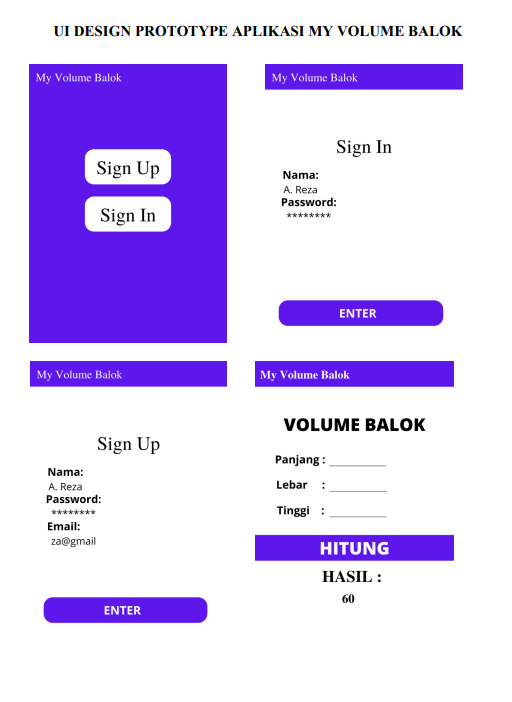
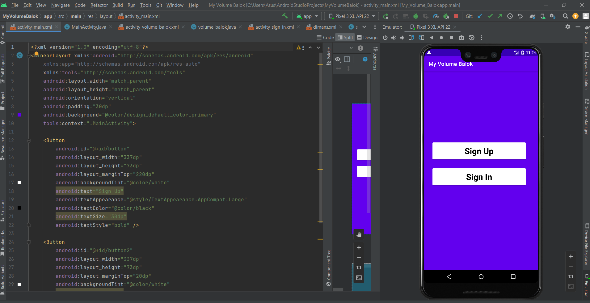
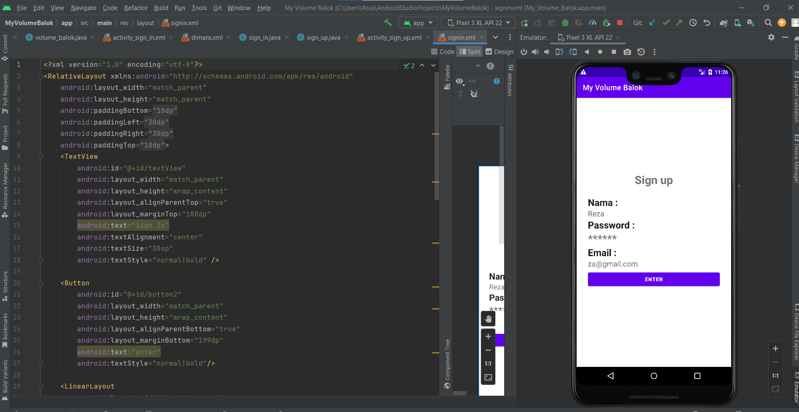
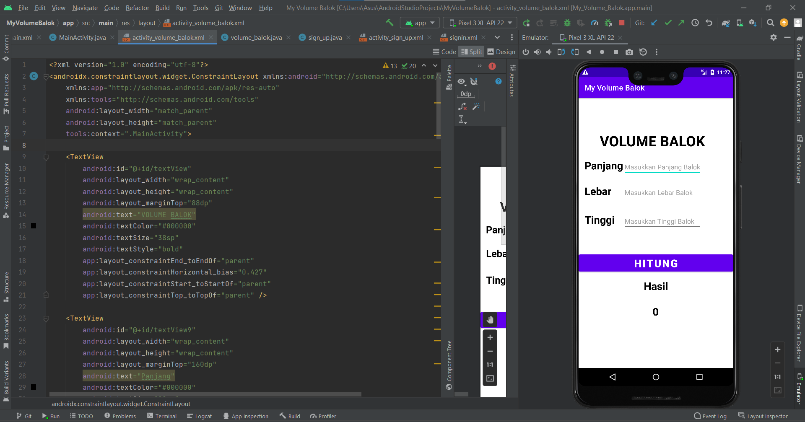

# project_uts_mobileapp

```sh
Nama    : A. Reza Baehaqa Jamroni
Nim     : 312110494
Matkul  : Pemrograman Mobile
```

### User interface (UI)

- User interface (UI) design atau desain antarmuka adalah proses yang digunakan desainer untuk membangun antarmuka dalam perangkat lunak yang berfokus pada penampilan.

UI designer bertujuan untuk membuat tampilan antarmuka yang mudah digunakan dan menyenangkan pengguna adapun project saya buat adalah menghitung volume balok dengan design ada di bawah ini
<p>

### Tentang Aplikasi

- Volume Balok App adalah aplikasi untuk menghitung volume balok yang dibuat pada Android studio<p>

### Adapun design Aplikasi ini menggunakan <p>

- photo Shop
- Android Studio
- Java
- XML

### Override Methods yang digunakan

- OnClickListener
- SetOnClickListener
- saveInstanceStat

### Output Project yang telah dibikin

berikut adalah contoh tampilan hasil dari output yang saya bikin
<p>
<p>
<p>
<p>
